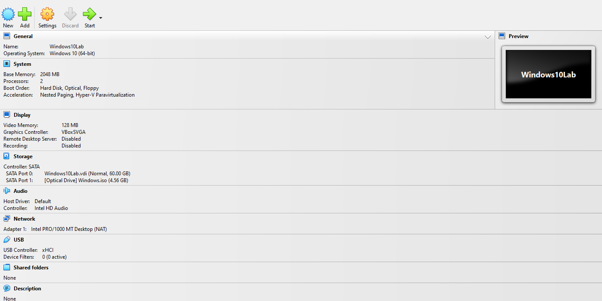
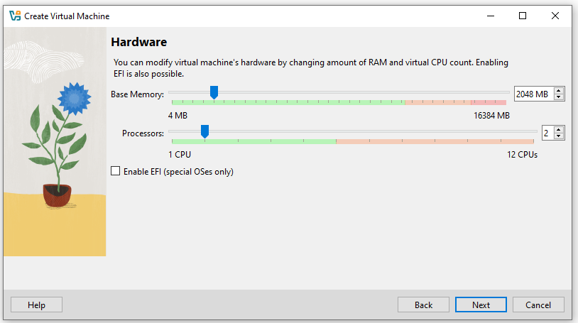
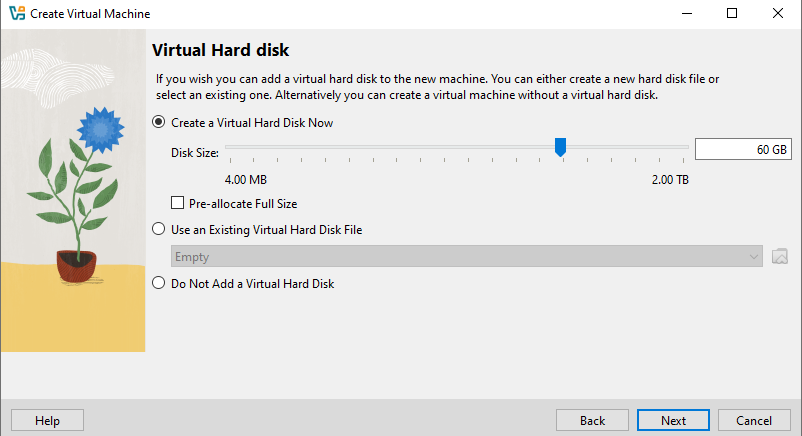
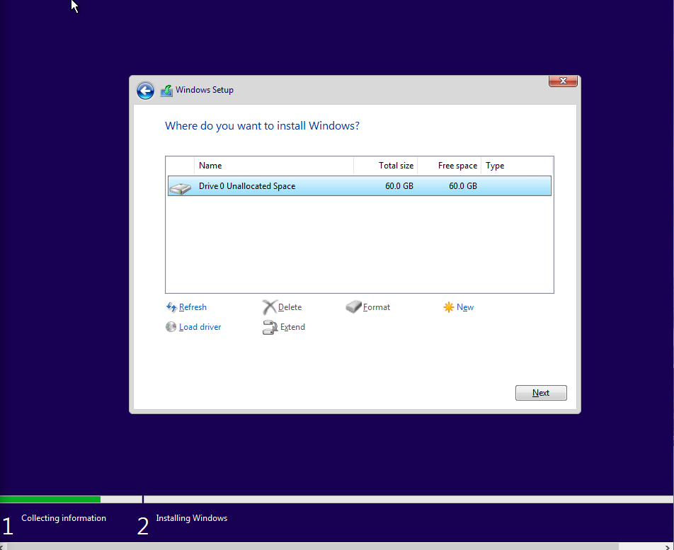
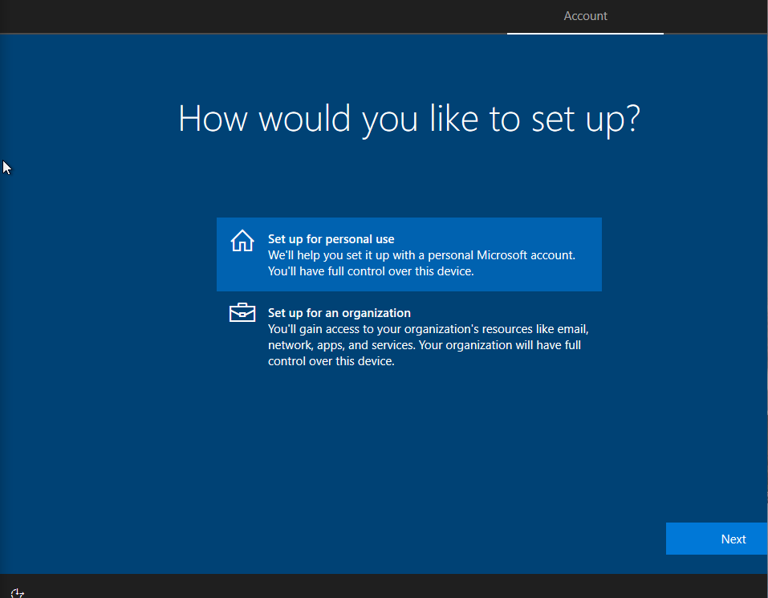
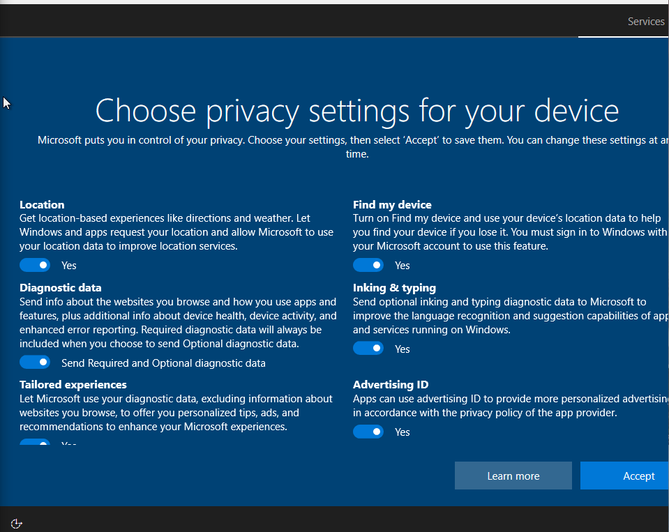
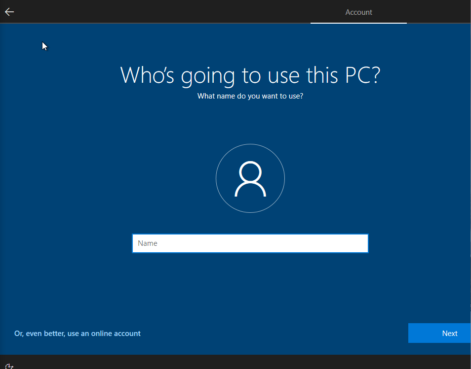
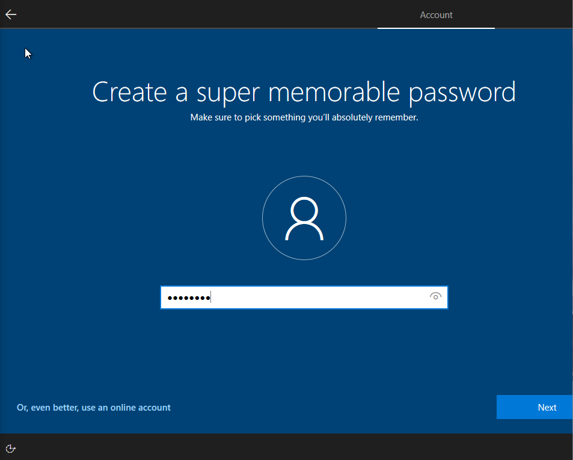
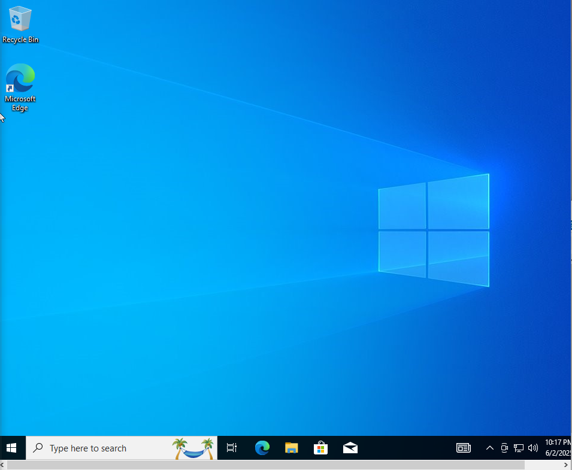

# IT Lab Portfolio

## Project Overview
A virtual IT lab environment built in VirtualBox. Includes Windows 10 installation, local account creation, and VM hardware configuration.

## Screenshots and Captions

### VirtualBox VM Setup
-   
  *Overview of the VirtualBox VM hardware configuration, including RAM, CPU, storage, and network settings.*

-   
  *Adjusting the VM's base memory (2048 MB) and processors (2) for optimal lab performance.*

-   
  *Creating a new virtual hard disk (VDI, dynamically allocated) of 60 GB for Windows 10 installation.*

-   
  *Initial setup summary in VirtualBox, showing VM creation details.*

-   
  *Confirming hardware and ISO file settings before creating the VM.*

### Windows 10 Installation & Setup
-   
  *Choosing the Windows 10 Pro (x64) edition during installation.*

-   
  *Setting up a local account name for the Windows 10 VM.*

-   
  *Creating a strong password for the local account.*

### Privacy and Initial Boot
-   
  *Selecting privacy settings for the Windows 10 installation.*

-   
  *First boot of the Windows 10 desktop environment, showing successful VM setup.*

---

## Skills Learned
- VirtualBox VM creation and hardware resource allocation.
- Clean installation of Windows 10 in a virtual environment.
- Setting up local user accounts for lab usage.
- Managing privacy and security settings during Windows installation.

---

