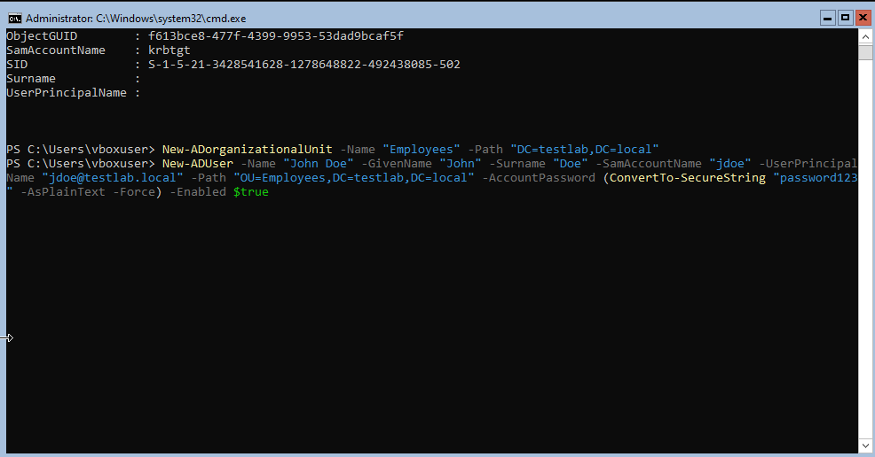

# IT Lab Portfolio

## Project Overview
A virtual IT lab environment built in VirtualBox. Includes Windows 10 installation, local account creation, VM hardware configuration, and a Windows Server 2022 domain environment.

---

## Screenshots and Captions

### VirtualBox VM Setup
-   
  *Overview of the VirtualBox VM hardware configuration, including RAM, CPU, storage, and network settings.*

-   
  *Adjusting the VM's base memory (2048 MB) and processors (2) for optimal lab performance.*

-   
  *Creating a new virtual hard disk (VDI, dynamically allocated) of 60 GB for Windows Server 2022 installation.*

-   
  *Initial setup summary in VirtualBox, showing VM creation details.*

---

### Windows 10 Installation & Setup
-   
  *Choosing the Windows 10 Pro (x64) edition during installation.*

-   
  *Setting up a local account name for the Windows 10 VM.*

-   
  *Creating a strong password for the local account.*

-   
  *First boot of the Windows 10 desktop environment, showing successful VM setup.*

---

### Windows Server 2022 Domain Controller

#### Overview
- Windows Server 2022 Core (no GUI).
- Configured as the domain controller for the `testlab.local` domain.
- Connected to the client VM in an internal network for isolated domain testing.

#### Key Steps
- Set static IP for the Server Core: `192.168.56.10`.
- Installed Active Directory Domain Services (ADDS).
- Created a new Organizational Unit (`Employees`) and a user (`jdoe`).
- Joined the client VM to the `testlab.local` domain.
- Configured firewall rules for ICMPv4 (ping).

---

#### Screenshots and Captions

-   
  *Server Core static IP setup using PowerShell.*

-   
  *Installing Active Directory Domain Services and creating the `testlab.local` domain.*

-   
  *Creating the `Employees` organizational unit and adding `John Doe` as a domain user.*

-   
  *Joining the Windows 10 client to the `testlab.local` domain.*

-   
  *Adding an inbound firewall rule for ICMPv4 (ping) on the client VM.*

-   
  *Client VM successfully joined to the `testlab.local` domain.*

---

### Skills Learned
- VirtualBox VM creation and hardware resource allocation.
- Clean installation of Windows 10 in a virtual environment.
- Setting up local user accounts for lab usage.
- Static IP and DNS configuration via PowerShell in Server Core.
- Installing and configuring Active Directory Domain Services.
- Creating and managing Organizational Units and users in AD.
- Configuring Windows Firewall rules to enable domain communication.
- Joining a Windows 10/11 client to an Active Directory domain.

---

## Final Lab State
✅ Domain controller (`testlab.local`) operational.  
✅ Client joined to domain.  
✅ Inbound ping (ICMPv4) working for connectivity testing.  
✅ Ready for further lab testing (GPOs, file sharing, DNS, etc.).

---

